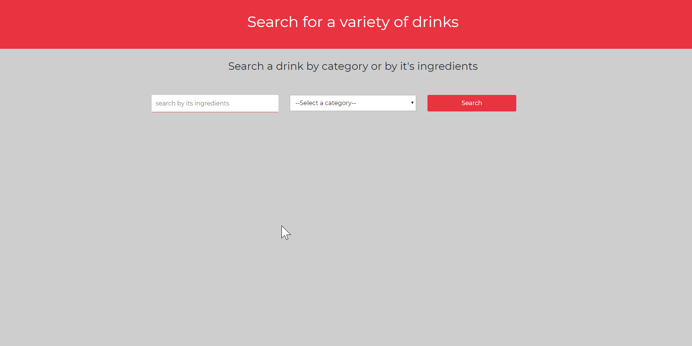
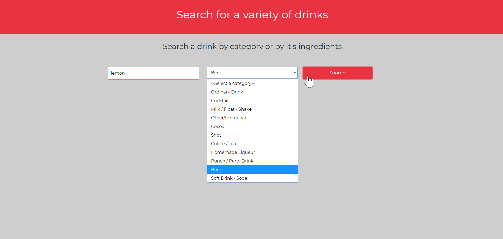
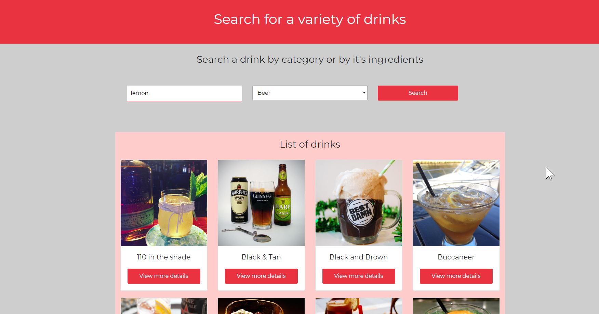
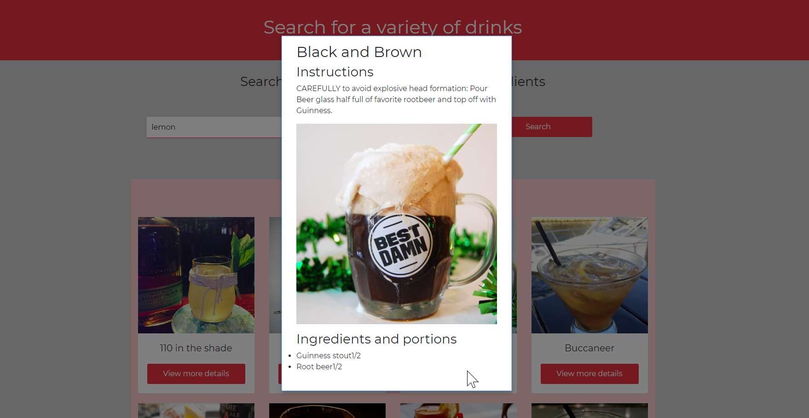

React Drinks
-using react hooks and react context

This project uses react Context for state management, 

You can enter an ingredient and then select a drink category

API used:https://www.thecocktaildb.com/api/json/v1/1/list.php?c=list

This project makes 3 API call's, one to get the categories from the drop down menu, the second one to display the drink accordint to what the user selected and the third one to show the details of each drink

Deployed in netlify https://adoring-poincare-1c1da9.netlify.app/

How the project looks like:

Home
  
  
  

